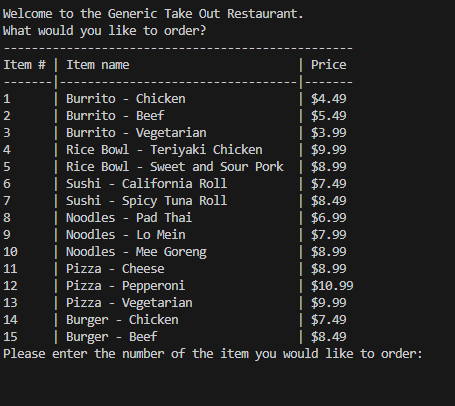
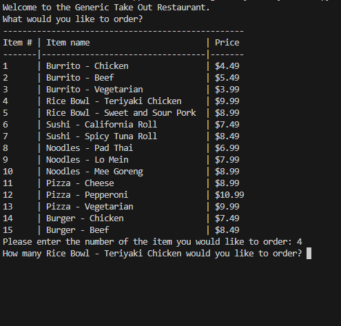
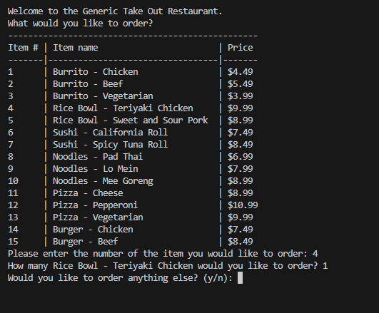
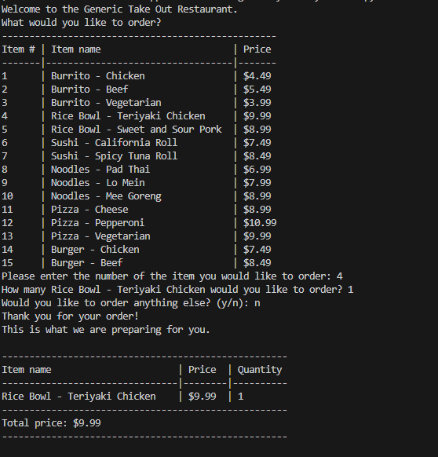

# Restaurant-Order-System

[] 

This project is a python based terminal application. It allows customers to interact with a restaurants takeout menu system. Users can view the full menu, 
place orders, alter quantities, and receive an itemized receipt without interacting with restaurant staff until food pickup.

## Table of Contents (Optional)

If your README is long, add a table of contents to make it easy for users to find what they need.

- [Installation](#installation)
- [Usage](#usage)
- [Features](#features)
- [Credits](#credits)
- [License](#license)
- [ContactMe](#contactme)

## Installation

Make sure you have python installed on your local machine. 

Clone this repository
Navigate to the project directory on your computer
Once there, open your terminal and run 'python order_system.py'

## Usage

Upon opening the file in python, view the menu: 

Decide on a quantity for the item(s) that you choose:

Decide if you would like to continue ordering or not: 

Receive an itemized receipt: 

## Features

* View all menu items with their categories, names, and prices.
* Place orders, specify quantities, and continue or finish your order. 
* Provides an itemized receipt for your order. 

## Credits

Credit to Edx Full Stack Bootcamp instructors and TAs for starter code. 

## License

Licensed under MIT

# Contact Me

| Name           | Email                     | GitHub Link                                | LinkedIn Link                                           |
|----------------|---------------------------|--------------------------------------------|---------------------------------------------------------|
| Mekenna Baker  | mekenna.drabner@gmail.com | [GitHub](https://github.com/Mekenna-Baker) | [LinkedIn](https://www.linkedin.com/in/mekenna--baker/) |